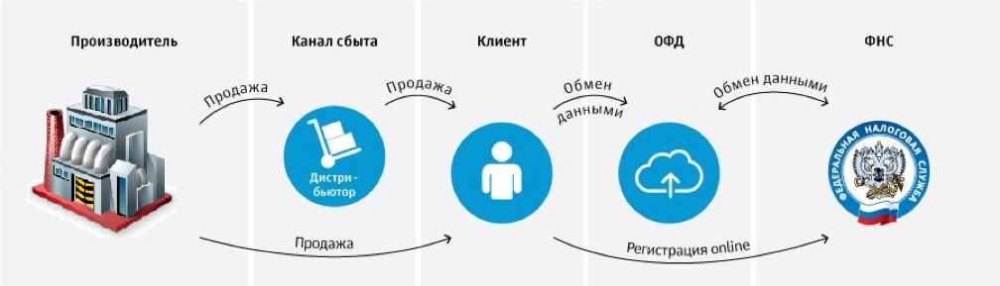
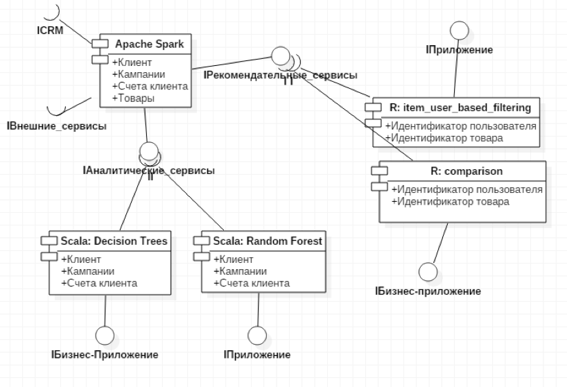
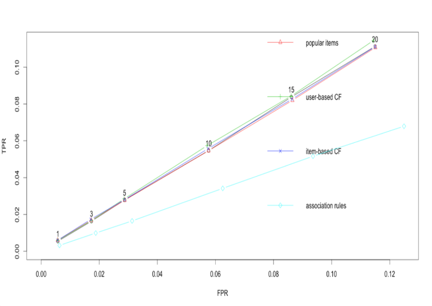

# Recomendation Service

## Description

I considered the draft law of e-checks, analysed the banking industry and created a data science product which provides 
personalised experience for banking customers. This was possible after the developing an intellectual algorithm for the 
most relevant banking offers selection, based on the methods of collaborative filtering. These algorithms are implemented 
for the scalable software platform Apache Spark in Scala and R. The experiments aimed at assessing the quality and 
scalability of the implemented algorithms were conducted on the Microsoft Azure cloud service.

The repository includes:
* Installation notes for environment deployment (**install_env.txt**)
* Source code for creating collaborative filtering (**item_based_filtering.R** and **item_user_based_filtering.R**)
* Source code to compare recommendations (**comparison_recomendations.R**)
* Source code for creating content-based recommendations (**DecisionTrees.scala** and **RandomForests.scala**)
* Initial datasets to make analysis (**bank.csv** and **Data.csv**)
* Initial datasets to make analysis (**bank.csv** and **Data.csv**)
* Results (**Report.Rmd**) and action plan + marketing research (**diploma.docx**)

## Usage
### Requirements
* `recommenderlab`
* `ggplot2`
* `Spark MLlib`

For reproducing the results, download repository and run files separatelly file.

## License
Copyright (c) 2018 Ekaterina Lyapina. Contact me for commercial use (or rather any use that is not academic research) (email: aegorfk at gmail.com). Free for research use, as long as proper attribution is given and this copyright notice is retained.
